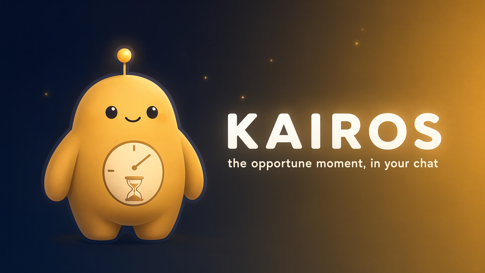

<p align="center">
  
</p>

<h1 align="center">Kairos</h1>

<p align="center">
  <b>The opportune moment, in your chat.</b><br>
  A self-hosted <b>Twitch chat bot</b> written in <b>Nim</b> — economy, mini-games, an LLM-run quest system, stocks and trophies.
</p>

<p align="center">
  <a href="https://dilidin2.github.io/kairos/">🌐 Website &amp; command reference</a>
  ·
  <a href="https://github.com/dilidin2/kairos">GitHub</a>
</p>

---

Kairos is a single Nim binary. Clone it, drop in your Twitch client ID, run it, and it joins your chat. No cloud, no account, no subscription — it lives on your machine and only talks to the Twitch API.

It's built as a **plugin** system: each feature is a small folder you can keep, drop, or extend. What ships in the box is a full set of systems that already play well together:

| System | What it does |
| --- | --- |
| 🪙 **Economy** | A per-viewer coin balance. Earn, spend, and pay each other out. |
| 🎰 **Games** | 8-ball, slots, coin flips and betting — small gambles with small stakes. |
| 🧭 **Quests** | An LLM directs live quests to opt-in viewers, written in character. |
| 📈 **Stocks** | A virtual market with prices, trends and portfolios you can trade in chat. |
| 🏆 **Trophies** | One-time unlocks and streaks, so coming back feels like progress. |
| 🎭 **Fun** | Roasts, jokes, truths and dares — quick, spicy chat energy. |
| ❓ **Quiz** | Trivia rounds the whole chat can answer together. |
| 💬 **Quotes** | Fill-in-the-blank phrase games and races to complete the line. |
| 🌫️ **Vanish** | Let a moderator sweep a user's messages off the live, dramatically. |

See the [website](https://dilidin2.github.io/kairos/) for the full command reference.

## Requirements

- Nim >= 2.0.0
- `ws` (installed via nimble)
- *(optional)* any OpenAI-compatible LLM server for the quest system

## Installation

```bash
nimble install
```

## Configuration

Copy `config/bot_config.json.example` to `config/bot_config.json` and edit the values.

The token files (`data/bot_token.json`, `data/broadcaster_token.json`) are created automatically after Twitch OAuth. Each plugin folder in `commands/` ships `.example` copies of its JSON files (`commands.json`, data files) — copy them to the real filenames, otherwise the plugins start with no commands registered, the `config.json` files in each plugin folder has the "enabled" key on true by default; edit those files to disable a specific plugin by setting it to false.

Set the `TwitchClientId` in `src/kairosbot/config/config.nim` if you plan on forking and using your client id.

To enable the LLM-driven quest system, point the `llm_server` config block at any OpenAI-compatible endpoint (`base_url`, `model`, `api_key`) and set `quest_system.enabled` to `true`.

## Usage

**First run (broadcaster authentication):**
```bash
./kairos
```

**Run with a dedicated bot account (log off twitch from your broadcaster account and log in with a secondary account to let it chat instead of your main account):**
```bash
./kairos --bot
```

## Build

```bash
nimble build
```

**After adding/removing every plugin you need to build again**

## Test

```bash
nimble test
```

## License

MIT
